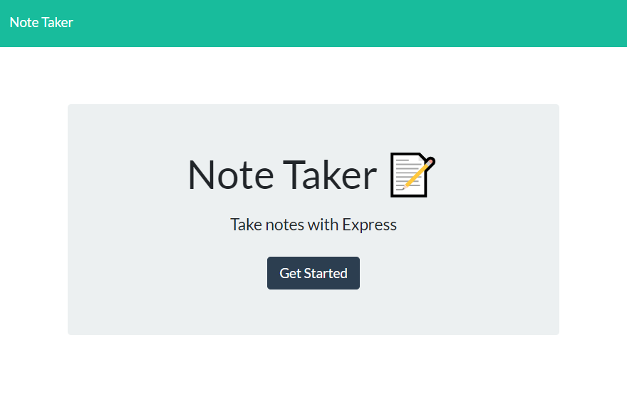
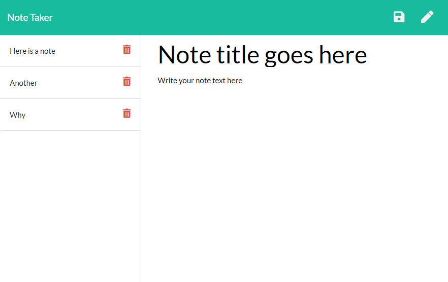

# Notify

## Description
    A productivity app for writing, saving, and deleting notes.
    
## Table of Contents 
1. [Installation](#installation)
2. [Usage](#usage)
3. [Technologies](#technologies)
4. [Demo](#demo)
5. [License](#license)
6. [Contributing](#contributing)
7. [Tests](#tests)
8. [Questions](#questions)
    
## Installation
The app requires an Internet connection and can be used directly through your browser.

## Usage
You can use the app by visiting at the following url: https://secret-plains-76271.herokuapp.com/. From the homepage, click "Get Started" to go to the notes page. Click the pencil icon in the top right corner of the page to begin creating a new note. Enter a note title and text and click the save icon in the top right to save your night. Click a saved note on the left side panel to bring up the full text for that note. Click the red trash can icon to delete the note. 

## Technologies
Node.js, Express.js (4.16.4), uniqid (5.2.0), nodemon (2.0.6), Bootstrap, CSS, HTML.

## Demo

      

## License 
  
Copyright (c) 2020 Rudi Kraeher
    
## Contributing
If you wish to contribute to the project send me an email.
    
## Tests
At this time I have no guidelines for testing.
    
## Questions
If you have any questions about the repo you can email me at rudikraeher@gmail.com.  
Visit my [GitHub](https://github.com/rkraeher) to see more of my work.